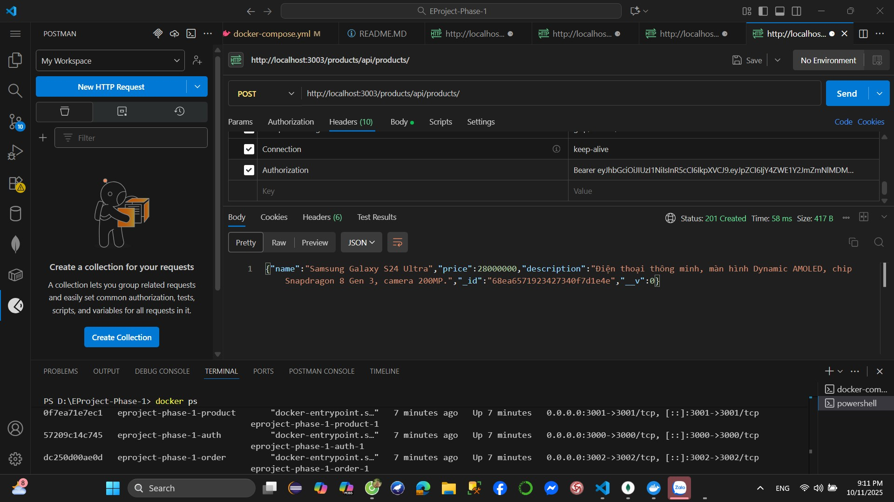

Download source code

Run npm install

Setup all microservices

Test all business logic with POSTMAN

-REGISTER

 - TRUONG HOP DA DANG KY TEN DO :
 

 {"message":"Username already taken"}

-LOGIN

docker-compose up --build

