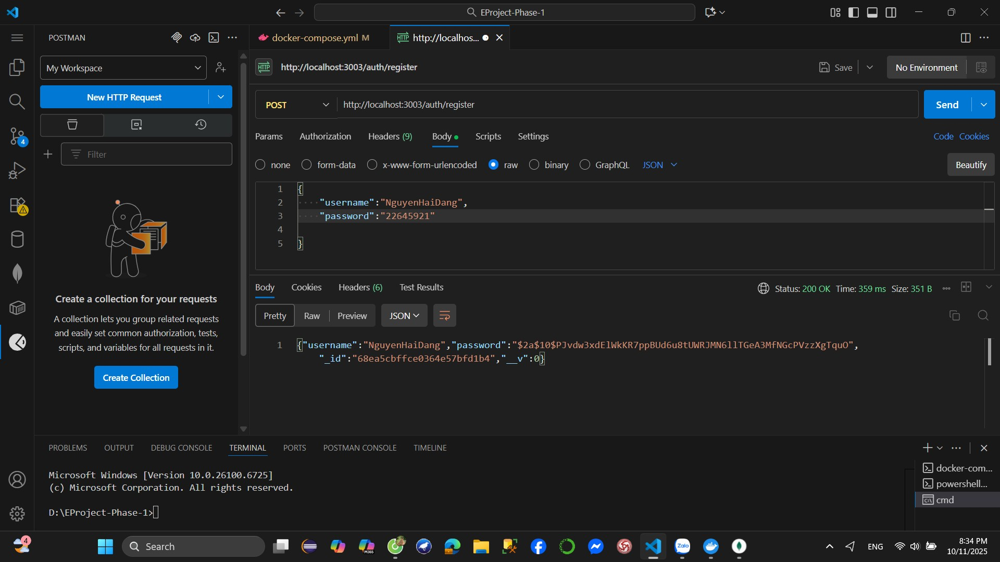
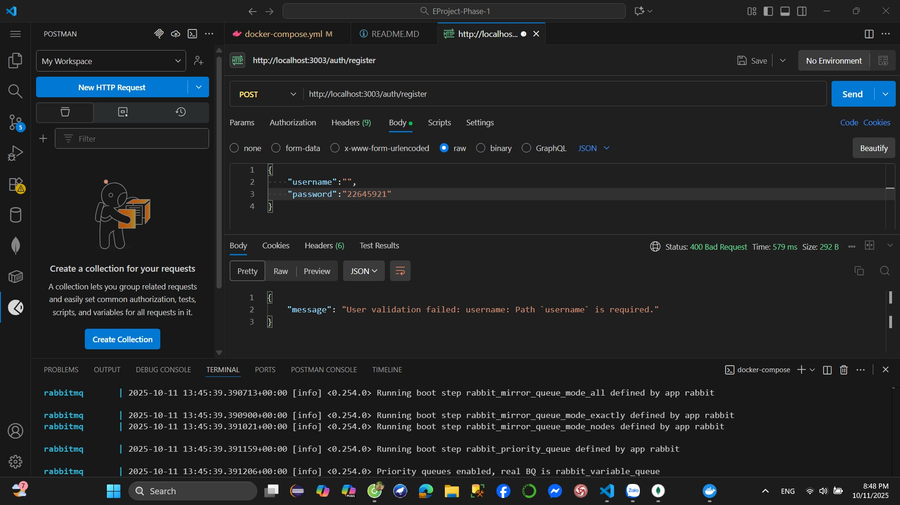
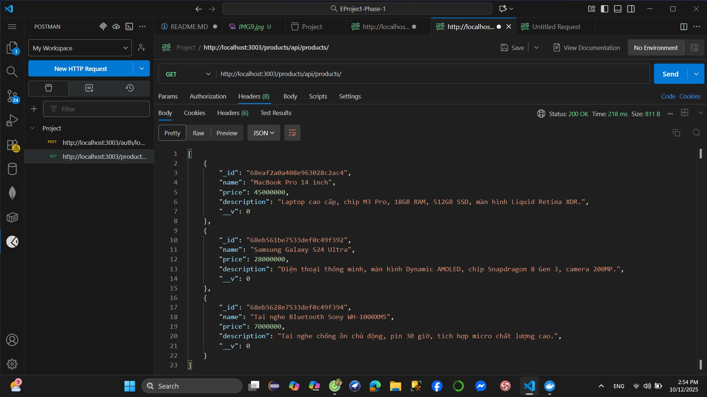

Download source code

Run npm install

Setup all microservices

Test all business logic with POSTMAN

-REGISTER

 - TRUONG HOP DA DANG KY TEN DO :
 {"message":"Username already taken"}

-LOGIN

-NHAP SAI USERNAME OR PASSWORD

-CREATE PRODUCT

 - ERROR CREATE PRODUCT 
 

- GET DANH SACH PRODUCT 

- ORDER 

 
- SHOW MONGODB 
docker exec -it mymongodb bash

docker ps

docker-compose up --build

